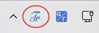
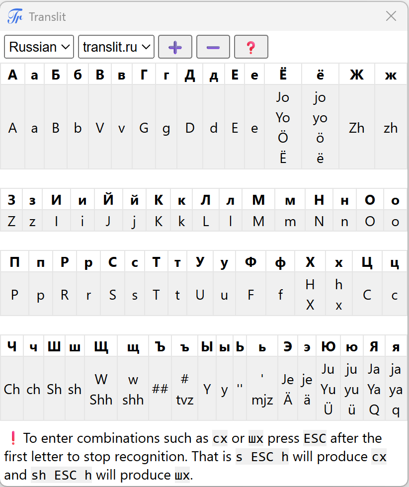

#  Translit for Windows

<!-- Links -->
[translit_ru]: https://translit.ru
[releases]: https://github.com/gershnik/TranslitForWindows/releases
[mactranslit]: https://github.com/gershnik/Translit

<!-- End Links -->

This Windows _text service_[^1] allows a user familiar only with Latin alphabet keyboard to 
type in other languages by using common Latin transliteration of the target language letters. 
Currently supported target languages are Russian, Hebrew, Ukrainian and Belarusian. 
To give an example, typing `privet` in Russian mode will produce `привет` and typing `hi` in Hebrew mode will produce `הי`.

[^1]: sometimes called an IME but technically IME is a different older technology

> [!NOTE]
> This software is for Windows only. A macOS version is available [here][mactranslit]

- [Features](#features)
- [Installation](#installation)
- [Configuration](#configuration)
- [Uninstall](#uninstall)
- [Mappings](#mappings)
- [Building](#building)

## Features

- Type normally in any window without copy/pasting from a separate app/browser
- Integrates natively with Windows language/keyboard switching support using official, documented Microsoft APIs. 
  No hacky apps that need to run in the background and hook/hack into the OS workings.
- Works in all apps: desktop and store and even login screen, x64, x86 and arm64.
- Supports modern Windows versions 10 and 11
- Supports multiple languages: currently Russian, Hebrew, Ukrainian and Belarusian with an easy way 
  to add more, if desired.
- Not having to use punctuation like `'` or `#` for transliteration. 
  When typing normally on Windows (as opposed to some designated transliteration app) switching between 
  input modes is more complicated - you cannot just press `ESC` like [translit.ru][translit_ru] does. 
  This makes typing text with lots of punctuation annoying. Translit allows you to avoid punctuation, 
  for example using `q` for `ь` and `qq` for `ъ` making typing much smoother. 
- Support for multiple transliteration schemes. Since some people would rather use familiar transliteration schemes
  from elsewhere, this application allows you to choose the scheme.
  Currently, in addition to the default, [translit.ru/translit.net][translit_ru] schemes are supported for Russian, Ukrainian and Belarusian. More can be added, if desired.

  There are existing Windows transliteration apps available on the Internet but none of them supports all the features above.

## Installation
  
* Navigate to [Releases][releases] page and download `Translit-x64.msi` or `Translit-arm64.msi` installer 
  depending on your computer hardware. 
* Run it and install the app
* During the installation you will be prompted to selects the _default_ languages to enable. These will be available
  by default to all users when first using the app. Don't worry if you select wrong ones - all users will also be 
  able to add or remove languages for themselves later in application settings.
* When installation finishes look at the system tray. There will be a language icon there (if you haven't had one
  before). When you click it it should open a menu like this (assuming you selected Russian and Hebrew during the installation):
  
   
* That's pretty much it. You can now switch between English and Translit in any app using this menu or via
  `⊞ + Spacebar` key combination. 

## Configuration

When one of the Translit languages is active the system tray will have one additional icon 
(circled in red below):

 

Clicking it will launch Translit settings app. You can also always launch the settings from 
`Start Menu -> Translit`

The settings app screen looks like this:

 

It shows you the letter mappings for the language and transliteration scheme selected on top. 
Changing the scheme makes it the default for all apps for that language.

The ➕ and ➖ buttons allow you to add and remove languages. The ❓ button opens a traditional About 
dialog.

The app stays on top of other Windows to allow you to see the mappings when typing in another Window.

## Uninstall

Translit can be fully uninstalled via standard "Add/Remove Programs" (a.k.a. "Apps->Installed Apps")
system panel.

## Mappings

Currently supported character mappings can be found in the following documents

* [Belarusian](doc/mapping-be.md)
* [Hebrew](doc/mapping-he.md)
* [Russian](doc/mapping-ru.md)
* [Ukrainian](doc/mapping-uk.md)

## Building

Visual Studio 2022 or above and Python 3.11 or above are the only requirements to build Translit.
If you want to build the installers you will also need 
[WiX Toolset](https://github.com/wixtoolset/wix) CLI version 6.

* Download/clone the repo
* Run `python fetch.py` script from the top-level directory. 
  This will fetch external dependencies
* Open `Translit.sln` in Visual Studio and build the `Translit`, `Settings` or `Installer` targets

